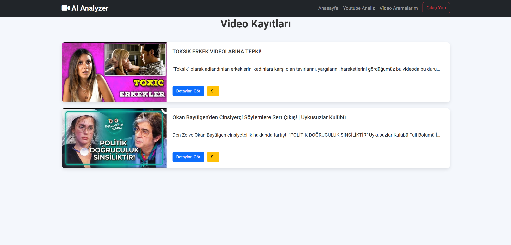

# YouTube CommentGuard

**YouTube CommentGuard** is a web-based application that automatically classifies YouTube comments into categories such as Neutral, Insult/Hate Speech, Sexism, and Racism. This project uses the Hugging Face [Nane Limon bert-base-turkish-bullying model](https://huggingface.co/nanelimon/bert-base-turkish-bullying). It aims to enhance content moderation by identifying harmful comments and providing a cleaner, safer environment for users.


## Features

- **Home Page**: A brief introduction to the project and its functionality.
- **YouTube Analysis Page**: Users can input YouTube video links to extract comments, video titles, descriptions, and images. The system then classifies the comments into one of the predefined categories.
- **YouTube Search Page**: Displays a list of previously analyzed videos, showing detailed information about each video, including the comments, comment authors, and classification results.
  
## Technologies Used

- **Django**: A powerful web framework for building web applications, handling user authentication, and database interactions.
- **Transformers**: Hugging Face library used to leverage pre-trained models like BERT for sentiment analysis and comment classification.
- **google-api-python-client**: Used to interact with the YouTube API to fetch video data such as comments, titles, and images.

## Usage

- **Register/Login**: Users need to register and log in to access the analysis pages.
- **YouTube Analysis**: Paste a YouTube video URL to fetch and analyze comments. The comments will be classified into one of the following categories:
  - Neutral
  - Insult/Hate Speech
  - Sexism
  - Racism
- **YouTube Search**: View previously analyzed videos, with detailed information about each comment, author, and classification.

## Screenshots

### Home Page


### YouTube Analysis Page


### YouTube Search Page


### Video Details


## Contributing

Contributions are welcome! If you want to improve or add new features, feel free to fork this repository and submit a pull request.

Please follow the guidelines below when contributing:
- Ensure that your code follows PEP 8 style guidelines.
- Write unit tests for new features.
- Provide clear commit messages.

### Steps

## 📦 Setup & Installation

1. Clone the repository:
    ```bash
    git clone https://github.com/HasanCan6241/CommentGuard.git
    ```
2. Navigate to the project directory:
    ```bash
    cd CommentGuard
    ```
3. Install the required dependencies:
    ```bash
    pip install -r requirements.txt
    ```
4. Run the Django server:
    ```bash
    python manage.py runserver
    ```

